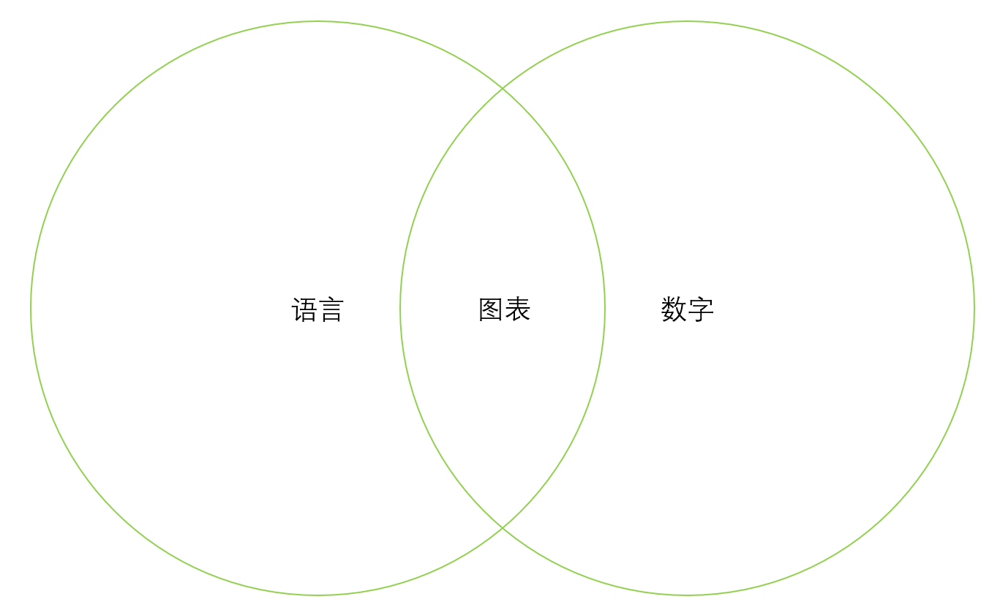
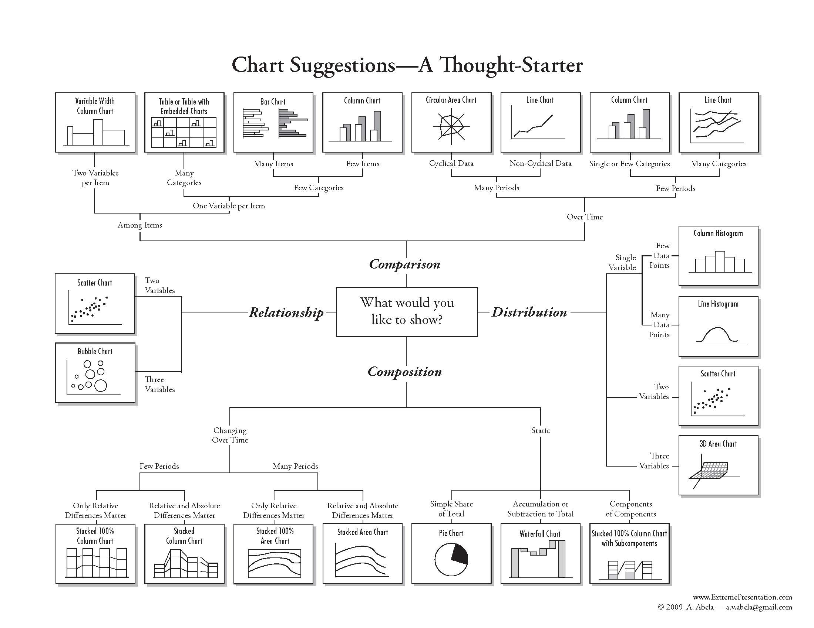
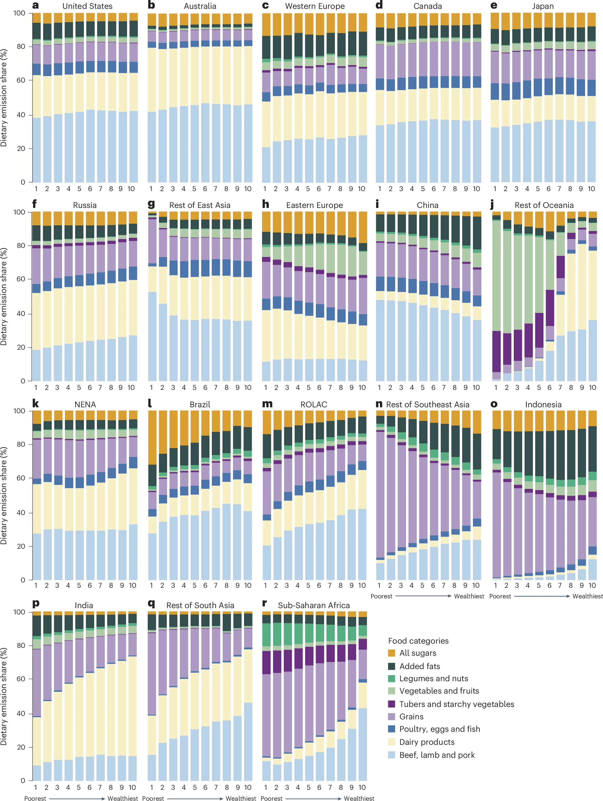
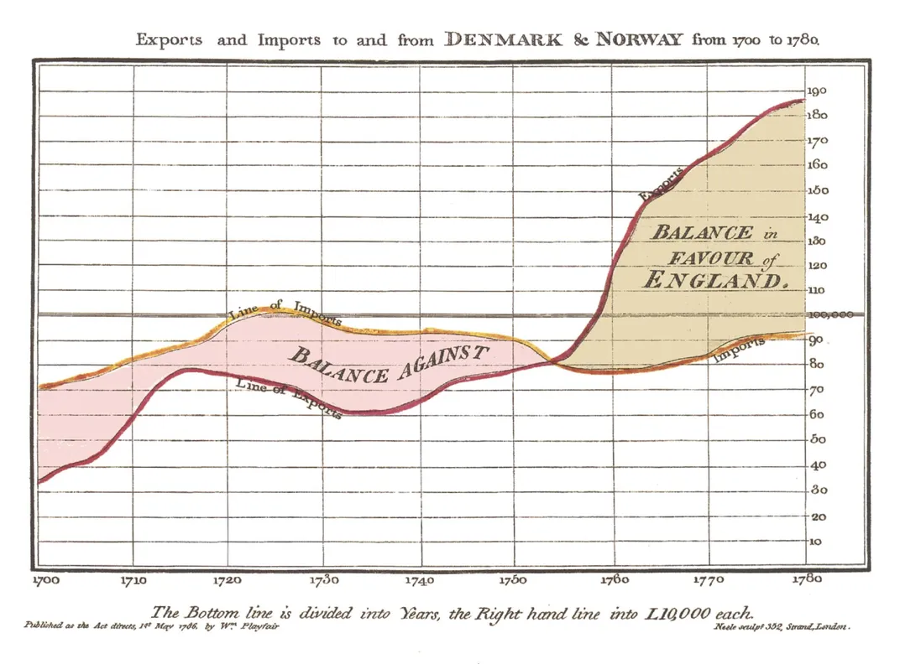
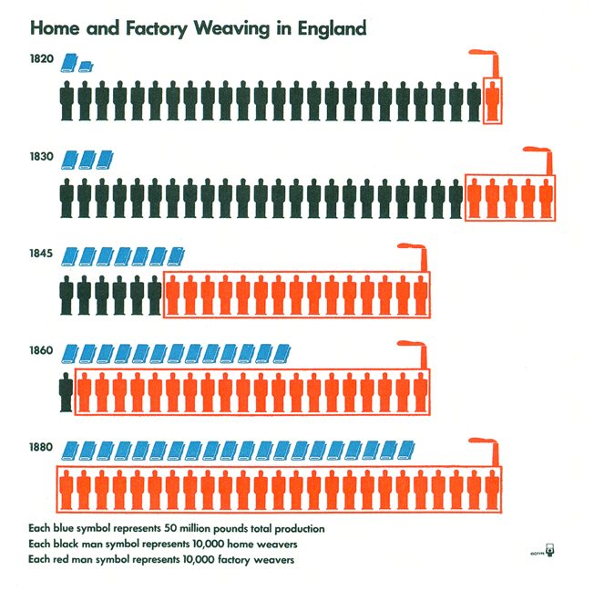

# 第一章：科研数据可视化基础

## 1.1 科研数据可视化概述
### 1.1.1 什么是数据可视化？
数据可视化指的是将复杂的数据转化为图形、图表、地图等视觉形式，帮助研究人员理解和传达数据中的信息。它的目的不仅仅是"展示数据"，更是从数据中提取、分析并传达有价值的洞察。
### 1.1.2 为什么学习数据可视化
在我们的日常学习中，语言和数学是最常见的两样技能。在学校里，我们会学习通过学习语言将词语组合成句子、段落和故事，从而有效地传递信息；在数学方面，我们也学会了如何处理数字，并理解它们的意义。然而，语言和数学往往是分开教授的，我们很少有机会将它们结合起来使用。特别是，学校里很少有课程教我们如何用数字讲故事。
 
然而，在现实世界中存在着无处不在的数据。随着科技的飞速发展，，信息也变得更加复杂，我们也需要一些工具来收集和存储大量的数据。这就带来了一个问题：我们如何从这些海量的数据中提取有用的信息？单纯的数据本身很难直接地帮助我们做出决策，它需要通过清晰的方式来展示，才能更好地为我们服务。

这正是数据可视化的核心价值所在。数据可视化不仅仅是将数据转化为图表，它的目的在于通过图表帮助我们更直观、更有效地理解数据背后的故事。良好的数据可视化能够将复杂的数据简化为易于理解的图形，使得决策者能够在短时间内获取信息并做出更加明智的决策。

过去，制作图表的工作通常是科学家和一些技术专家的专利。今天，随着技术的进步，各种数据处理工具已经变得非常普及，像Excel、Tableau、Python等工具使得几乎每个人都可以轻松制作图表。然而，这一变化虽然方便，但也带来了新的挑战：工具的普及意味着任何人都能制作图表，但这并不意味着所有的图表都能有效地传达信息。帮助大家解决这个问题，也是本课程的目标所在。

### 1.1.3 科研数据可视化的原则

>实话说，现在大多数现代教科书实际上包含了许多图片，通常是计算机生成的曲线和曲面。但是，除了极少数例外，这些图片都是特定的、具体的例子，它们只是解释了定理，这些定理的证明完全由符号操纵。这些图片说明不了什么！  
> 
——Tristan Needham《微分几何及形式的可视化方法》

很多人容易会科研的可视化产生一些误解。科研论文中的图表与一般数据可视化或常规图表绘制有显著区别，这些区别源于科研场景的特殊需求和学术出版的严格要求，因此在绘制科研图表时大概需遵循以下几个核心原则：

1.精确性与可靠性

科研绘图的首要目标是准确传达研究数据，避免任何可能引发误导的设计元素。例如，我们应使用恰当的刻度、单位和比例表示数据，并尽可能避免因设计过于艺术化而掩盖数据本身的科学价值。对于特定数据，我们需要准确展示数据的误差范围和统计显著性。避免因设计过于艺术化而掩盖数据本身的科学价值

2.清晰与简洁

科研图表必须直观地传递核心信息。避免添加无关或过于复杂的元素，这可能会干扰读者对主要数据的理解。例如，有两种特征在论文中非常重要：
- 高分辨率和高质量：确保图表在学术期刊的印刷或电子格式下仍然清晰可辨。  
- 一致性：在文章中保持颜色、比例、标签等方面的统一，使读者能快速理解图表内容。

3.可复现

科研图表不仅需要用于结果展示，还可能被引用或复用在后续研究中。因此，绘图工具（如Matplotlib、ggplot2等）需具备以下特点：
- 详细的自定义能力：允许对图表中的每个元素进行精确控制,确保符合特定期刊或会议的要求
- 可复现性：科研绘图的代码和数据需要可以重复运行,以支持研究的验证和扩展
- 批处理能力：能够高效处理大量数据集的可视化需求

4.出版与版权要求

科研绘图时需特别注意专业规范：
- 版权合规：在使用他人图表或素材时,应取得合法授权或使用许可,并在图注中清晰标明出处  
- 期刊规范：图表的设计和内容需符合目标期刊或会议的投稿规范,例如版面尺寸、颜色模式(如RGB或CMYK)和字体选择等  
- 完整说明：提供必要的图表说明,包括数据来源、处理方法等关键信息

## 1.2 图表类型与选择
在进行可视化前，选择图表类型是至关重要的。在各种教材里，我们能看到很多种图标选择的方式，其中Andrew Abela博士曾发表过一个比较经典的的流程图，有助于快速确定哪个图表更适合我们手头的数据。

所有图表被分为了四类：对比、关系、组织和分布。我们可以根据数据的类型来定位到自己合适那些图，或者排除一些可能对我们帮助没有那么大的图。

为了更加动态的对比他们的区别，可以参考[1 dataset 100 visualizations](https://100.datavizproject.com/)这个网站，上面展示了一组简单数据的100种不同图表化的可视化效果。

根据上面的分类，我们可以大概对比一下各种图表类型的优劣：

1.	柱状图
主要用于对比不同类别的数据。适用于展示各类别的数量或频次（如不同国家的GDP对比、各科目成绩的分布等）。直观简洁，适合展示小到中等量的数据。
 
2.	折线图  
用于显示数据随时间的变化趋势。适用于展示时间序列数据（如股票价格、温度变化等）。能清晰地表现数据变化趋势和波动。

3.	散点图  
用于显示两个变量之间的关系。适合分析变量之间的相关性（如体重与身高的关系、广告投入与销售额的关系等）。能够揭示变量之间的相关性及数据分布。
 
4.	饼图  
用于展示各部分占整体的比例。适用于表示组成部分与整体的比例关系（如市场份额、调查结果等）。适合展示部分与整体的比例，但过多的切分可能会让图表变得复杂。
 
5.	箱线图  
用于展示数据分布的范围、四分位数和异常值。适合于数据分布分析，尤其适合大数据集（如考试成绩、收入分布等）。可以显示数据的集中趋势、离散程度和异常值。
 
6.	热力图  
用于展示矩阵数据的密度或强度。展示复杂数据的模式（如基因表达数据、相关矩阵等）。色彩的渐变能够直观地呈现数据的强度变化。  
...
 

## 1.3 可视化美学与设计原则

### 1.3.1 可视化美学

在谈论所有的可视化美学之前，必须要记住，可视化的最终目的是为了向读者**传递信息**。而不同类型的美学属性适用于不同类型的变量：例如，颜色和形状适合分类变量，而大小更适合连续变量。同时，数据量的多少也会产生影响：如果数据量很大，可能难以区分不同的组，我们可以采用ggplot2中的faceting、或者seaborn的FacetGrid，把图片拆分拆分为不同的子图。

在图中使用美学属性时，通常有一个“少即是多”的原则。例如说，同时通过颜色、形状和大小展示关系有时会让人难以理解，因此在使用美学属性时须谨慎。与其试图创建一张同时展示所有内容的复杂图表，不如尝试一系列简单的图表，讲述一个清晰的故事，逐步引导没有知识背景的读者走过你需要表达的知识。

人们在会在初次制作图表时可能会犯一些美学上的常见错误，例如：
1. 使用过多的颜色或不合适的颜色搭配，建议一张图片颜色不能超过5个
2. 选择不适合的数据展示方式，如使用饼图表示复杂数据。子图尽量不要全用同一样式
3. 过度装饰，使用3D图形等可能使信息更加难以解读的设计。

这些问题往往源自于缺乏对数据可视化最佳实践的了解。因此，学习如何制作有效的数据可视化图表，不仅能够帮助我们更好地理解数据，还能确保我们在分享数据时能够准确、清晰地传递信息。

### 1.3.2 设计原则

**期刊规定**  
期刊对于论文中可视化所生成的图片会有一定的要求。例如，许多科技期刊经常要求作者投稿时提供高清晰度的图片，并且规定一定的分辨率，比如说线图1200 dpi， 彩色图表600 dpi，照片300 dpi。 图像大小同样会有规定，比如单栏宽89mm，双栏款183mm。
这是nature列出的[格式要求](https://www.nature.com/nature/for-authors/formatting-guide)，可以供大家参考。

**合适的字体**  
对于许多的期刊，论文的正文一般规定汉字使用宋体，英文使用TIMES NEW ROMAN。而配图的字体，有时会规定使用Arial或Helvetica这种非衬线体。若是没有明确规定，可以继续使用TIMES NEW ROMAN，

**合适的颜色搭配**  
No.1 色彩的数量  
科研论文插图配色时应尽量精简。主色调建议选择1-2个色系，变量内容较多时也可以选择3个色系。其他内容可以使用同一色系的不同饱和度、明度来进行区分。  
No.2 色彩的选择  
关于色彩搭配，主要需要考虑到对比度与突出。通常使用的色彩有近似色、相邻色和互补色三种，它们可以互相组合、互相搭配。近似色：由深到浅的同色系颜色，适合渐变效果。相邻色：色轮上相邻的颜色，易于过渡，适合和谐搭配。互补色：色轮上相对位置的颜色，对比强烈，适合底色搭配选择颜色后调整饱和度和亮度来优化颜色搭配，增强颜色区分度。

例如，我们可以看到，下图为[这篇论文](https://www.nature.com/articles/s41558-024-02084-1)所采用的堆积图，使用明显有对比度的三个色系来区分不同的参数，可以有效增加图片的可读性。

在AI时代，已经有很多工具可以辅助我们进行配色了，例如[这个网站](https://www.radix-ui.com/colors/custom)和[这个网站](https://www.fffuel.co/pppalette/)

## 1.4 可视化的历史

数据可视化并非始终如今日之所见。其目标、风格和技术手段经历了不断的演变。从最早期的手绘图表到现代的交互式数据，每个阶段都反映了特定时代的需求和技术水平。通过了解这些变与不变，我们可以更好地把握当前方法的合理性以及局限性。

可视化的历史大致可以分为以下这个几时期：

1. 19世纪早期到中期

最早用于表示数据的图形既简洁又抽象，同时主要是作为交流的工具。，这些早期图表的抽象性显得尤为突出。
这一时期的代表人物是William Playfair，他被广泛认为是统计图形之父，包括我们今天使用的最流行的图形（折线图、条形图、圆图和饼图）。下图所示的Playfair 的图表展示了英国与其贸易伙伴的贸易平衡。
这些图表最初的目标是传达信息，而非进行分析。斯诺的地图有时会被错误地用作视觉分析的例子，实际上它是为了说服人们而绘制的。

2. 1920-30年代

20世纪最初的30年间，Otto Neurath设计了一种视觉语言——ISOTYPE，ISOTYPE是“国际图形化教育系统”（International System of Typographic Picture Education）。这种图形不仅使数字更易于阅读，还传递了其含义。每个图标代表一定数量的对应对象，从而便于比较和读取数据。例如，想要展示工人和工厂的统计数据，就用小工人和小工厂的图标。

3. 1970-80年代

20世纪70年代末到80年代初出现了一种新趋势：复杂的信息图开始用于传递数据。 Nigel Holmes和Edward Tufte是此时期的两位代表人物。

Holmes使用“解释性图形”这一术语，不仅更少被误用，也更清楚地描述了其目标：解释数据及其背景。此外，霍尔姆斯还希望吸引读者的注意力并提供娱乐性。其结果是非常复杂且独特的信息图，但始终基于真实数据。

与Holmes形成鲜明对比的是，Edward Tufte非常重视显示数据，他提倡一种最小且无需意义的样式。尽管塔夫特一直在谈论显示信息，但他的重点是显示用于分析的数据。他的观点集中于静态表示的形式，用户可以检查和使用它们来探索数据和回答问题。

4. 2000年代后：信息图 vs. 可视化

如今是信息爆炸的年代，信息图大量涌现，也混合了许多不同的风格。其中，有很多风格夸张的图表，这些图表往往更突出。这些信息图常被用来吸引注意力并为普通文章带来流量；这一点本身无可厚非，霍尔姆斯的作品部分也有类似作用。

然而，不少现代信息图缺乏准确性和深度。与1980年代通常有助于理解数据背景的信息图相比，如今许多信息图只是增加了视觉效果，却几乎无实际用途，同时在数据使用上相当随意。

 
 

参考文章：  
1.[ggplot2: Elegant Graphics for Data Analysis (3e)](https://ggplot2-book.org/)  
2.[The Changing Goals of Data Visualization
](https://eagereyes.org/blog/2012/changing-goals-data-visualization)