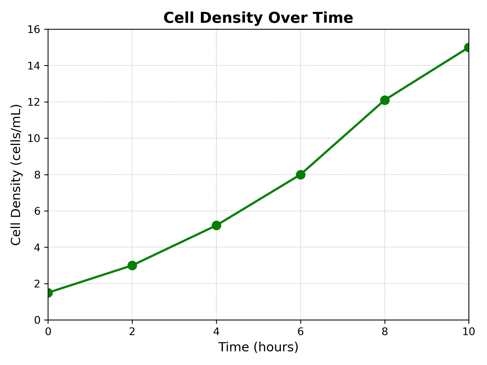
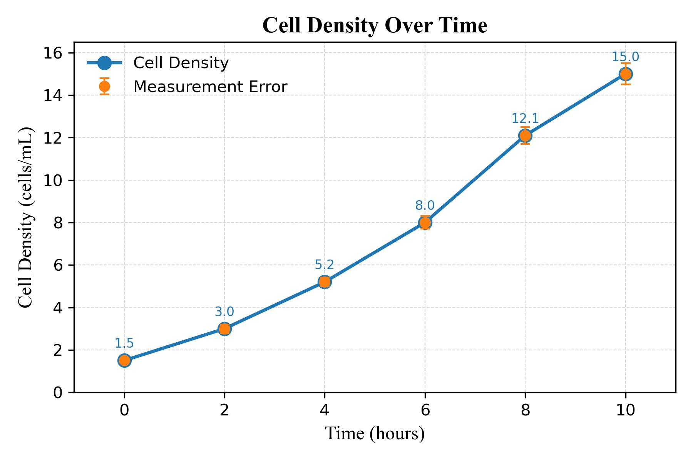
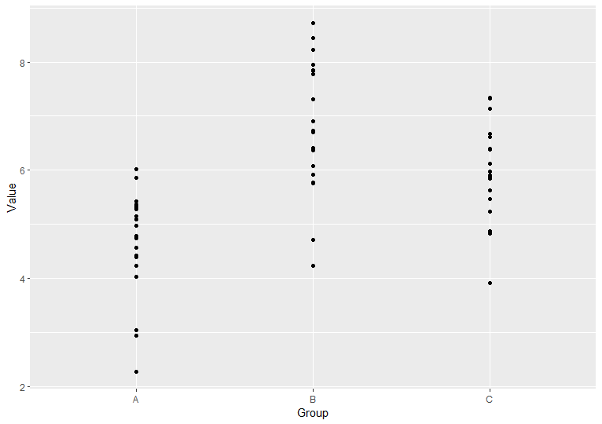
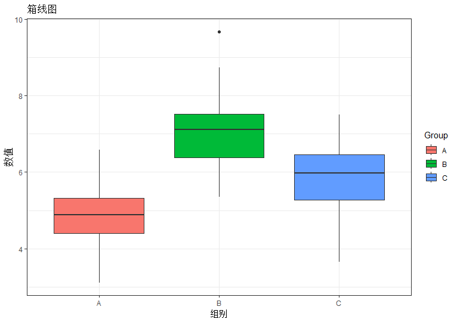
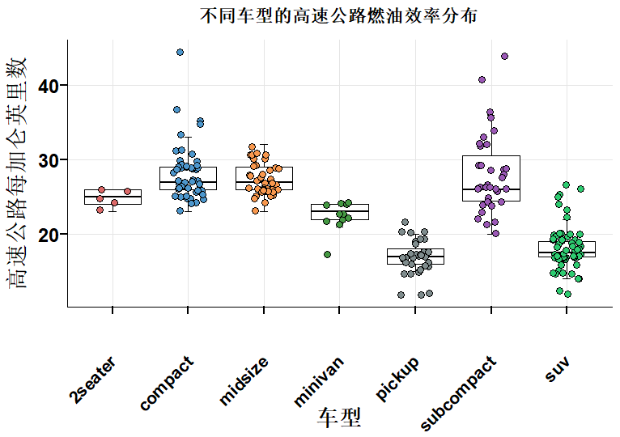

# 第二章：数据可视化工具
## 2.1 Python可视化

### 2.1.1 Matplotlib基础
Matplotlib是Python最基础的可视化库，提供了极高的自由度和完整的控制能力。由于论文中常用的可视化方法无需处理复杂的代码逻辑，本节仅关注较为基础的功能。

**安装与基本使用**

Matplotlib的安装非常简单，可以通过以下命令安装：

```python
pip install matplotlib
```

在安装完成后，导入Matplotlib的标准库 pyplot，它包含了创建图形的常用功能
```python
import matplotlib.pyplot as plt
```

首先我们先创建一个简单的折线图
```python
import matplotlib.pyplot as plt

x = [0, 1, 2, 3, 4]
y = [0, 1, 4, 9, 16]

# 绘制折线图
plt.plot(x, y)
plt.show()
```

在此基础之上，通过命令设置标题和标签

```python
plt.plot(x, y)
plt.title('Sample Plot') # plt.title() 设置标题
plt.xlabel('X Axis')
plt.ylabel('Y Axis') # plt.xlabel() 和 plt.ylabel() 设置坐标轴标签
plt.show()
```
同时，我们可以定制坐标轴
```python
plt.plot(x, y)
plt.xlim(0, 5)  # 设置 X 轴范围
plt.ylim(0, 20)  # 设置 Y 轴范围
plt.show()
```
可以自定义图形的外观，诸如线条、颜色和样式等
```python
plt.plot(x, y, linestyle='--', color='r', linewidth=2)
plt.show()

# linestyle='--' 改变线型为虚线

# color='r' 设置线条颜色为红色

# linewidth=2 设置线条宽度


```
也可以在背景当中添加网格线
```python
plt.plot(x, y)
plt.grid(True)
plt.show()
```
好的，现在我们以细胞密度随小时的变化图像为例，把我们提到的功能都加上
```python
import matplotlib.pyplot as plt
import numpy as np

# 示例数据：时间（小时）和细胞密度（细胞数/毫升）
time = np.array([0, 2, 4, 6, 8, 10])  # 时间点
cell_density = np.array([1.5, 3.0, 5.2, 8.0, 12.1, 15.0])  # 细胞密度
error = np.array([0.1, 0.2, 0.2, 0.3, 0.4, 0.5])  # 测量误差

# 创建图形
plt.plot(time, cell_density, marker='o', color='green', linestyle='-', linewidth=2, markersize=8)

# 设置标题和标签
plt.title('Cell Density Over Time', fontsize=14, fontweight='bold')
plt.xlabel('Time (hours)', fontsize=12)
plt.ylabel('Cell Density (cells/mL)', fontsize=12)

# 设置坐标轴范围
plt.xlim(0, 10)
plt.ylim(0, 16)


# 显示网格线
plt.grid(True, which='both', linestyle='--', linewidth=0.5, alpha=0.7)

# 显示图形
plt.show()


```
生成的图像如下图所示：



从美学方面来看，这个图表还不够好。直接拿Python输出的图片用于印刷可能会比较勉强，下一节我们会提到更加规范的科研制图技巧。


### 2.1.2 学术风格的应用
对于科研论文的绘图来说，制图不仅仅是把图片生成出来就万事大吉，还有很多规范需要考虑到。我们列举一些比较常用的注意事项。

我们仍然以之前的数据为例：

**网格的使用**


为了简洁与美观，期刊里倾向于使用轻微的网格线，或选择性使用、甚至不使用网格线，以避免分散注意力。过于显眼或密集的网格线可能会让图形显得杂乱。

我们可以将网格线设置为更淡的辅助线。


```python
plt.grid(True, which='major', linestyle='-', linewidth=0.5, color='gray', alpha=0.3)
```

**误差条的设计**

如果存在误差条或者其他设计，其本身通常不显眼，线条宽度更细，端点更小，以减少视觉干扰。同时，也建议将数据点标记的样式调整得更突出，以便于读者聚焦数据本身。

```python
plt.errorbar(time, cell_density, yerr=error, fmt='o', capsize=3, elinewidth=0.8, color='black', markersize=6, markerfacecolor='white')
```


**配色的修改**


关于配色，之前已经提到过，在这里我们可以采用更加柔和的色彩搭配，同事同时减少彩虹色等过于鲜艳的配色。
在统一单一主色，我们可以并结合灰度和透明度来区分次要元素（如误差条和网格线）。

```python
plt.plot(time, cell_density, marker='o', linestyle='-', color='darkblue', linewidth=2, markersize=8)
```

让我们看看修改过的成品吧


```python
import matplotlib.pyplot as plt
import numpy as np

# 示例数据
time = np.array([0, 2, 4, 6, 8, 10])  # 时间点
cell_density = np.array([1.5, 3.0, 5.2, 8.0, 12.1, 15.0])  # 细胞密度
error = np.array([0.1, 0.2, 0.2, 0.3, 0.4, 0.5])  # 测量误差

# 创建图形，调整尺寸
plt.figure(figsize=(6, 4))

# 绘制主线条和误差条
plt.plot(time, cell_density, marker='o', linestyle='-', color='#1f77b4', linewidth=2, markersize=8, label='Cell Density')
plt.errorbar(time, cell_density, yerr=error, fmt='o', capsize=3, elinewidth=1.0, color='#ff7f0e', markersize=6, label='Measurement Error')

# 添加标注，向上偏移0.6个单位
for i, txt in enumerate(cell_density):
    plt.text(time[i], cell_density[i] + 0.6, f'{txt:.1f}', fontsize=8, ha='center', color='#1f77b4')

# 设置标题和坐标轴标签，字体为 Times New Roman
plt.title('Cell Density Over Time', fontsize=14, fontweight='bold', family='Times New Roman')
plt.xlabel('Time (hours)', fontsize=12, family='Times New Roman')
plt.ylabel('Cell Density (cells/mL)', fontsize=12, family='Times New Roman')

# 调整坐标轴范围和网格
plt.xlim(-1, 11)
plt.ylim(0, 16.5)
plt.grid(True, which='major', linestyle='--', linewidth=0.5, color='gray', alpha=0.3)

# 添加图例，使用专业配色对应
plt.legend(loc='upper left', fontsize=10, frameon=False)

# 自动调整布局
plt.tight_layout()

# 导出图形为 PDF 格式，确保高分辨率
plt.savefig('cell_density_optimized_adjusted.pdf', dpi=300, format='pdf')

# 显示图形
plt.show()

```
最终的生成的图像如下图所示


## 2.2 R语言可视化

### 2.2.1 ggplot2基础

首先，可以在https://cloud.r-project.org/ 这个网站下载并安装R语言。然后下载RStudio，具体的RStudio的配置可以在https://posit.co/download/rstudio-desktop/ 下载后参考内置的tutorial。

在RStudio的界面当中，安装ggplot2库，其余可选的库也可以按需安装。

```r
# 安装ggplot2
install.packages("ggplot2")
# 可选：安装dplyr包，用于数据处理
install.packages("dplyr")

# 加载ggplot2包
library(ggplot2)
library(dplyr)

```

在ggplot的语法中，```data```, ```aesthetics```和```geoms```是每张图的三个关键组成部分。
 ```geom()```函数规定在图形上放置什么样的几何对象(点、线、条、阴影区域)

在这里，我们可以使用类似```ggplot(data, aes(x, y))```的方法，实现指定数据和美学映射，其结构大致如下：
```r
ggplot(data = <数据集>, aes(<美学映射>)) + 
  <几何对象> + 
  <标度调整> + 
  <坐标系统> + 
  <主题> + 
  <其他组件>
```

我们仍然从创建一个基础的图形开始练手。下面的代码利用创建的数据可视化了一个简单的散点图：

```r
library(ggplot2)

# 创建示例数据
df <- data.frame(
  Group = rep(c("A", "B", "C"), each = 20),
  Value = c(rnorm(20, mean = 5), rnorm(20, mean = 7), rnorm(20, mean = 6))
)
# 查看数据
head(df)

ggplot(data = df, aes(x = Group, y = Value)) +
  geom_point()

```
让我们直接看看效果



跟刚刚的语法类似，下面让我来画一个论文中常见的箱线图。


```r
library(ggplot2)

# 创建示例数据
df <- data.frame(
  Group = rep(c("A", "B", "C"), each = 20),
  Value = c(rnorm(20, mean = 5), rnorm(20, mean = 7), rnorm(20, mean = 6))
)

# 查看数据
head(df)

ggplot(data = df, aes(x = Group, y = Value, fill = Group)) +
  geom_boxplot() +
  theme_bw() +
  labs(title = "箱线图", x = "组别", y = "数值")

```



仍是利用刚才的数据，我们创建了一个默认配置的箱线图。值得注意的是，不同的工具画出的箱线图可能会有不同的效果，我们可以根据自己的需要来调整。


### 2.2.2 学术风格的优化

对于刚刚所生成的箱线图，我们可以对他进一步的修改，将其优化为更符合学术期刊标准的图表。这次，我们换上ggplot2所绑定的我mpg数据，这是一个[覆盖了1999年至2008年38款热门车型燃油经济性数据的库](https://ggplot2.tidyverse.org/reference/mpg.html) ，我们可以让图示内呈现的内容更多。

按照此前在matplotlib所述的优化，我们同样可以对ggplot2进行优化。如果了解R语言基础语法的话可以发现，相比与matplotlib，ggplot2是基于图形语法的，更注重声明式绘图方式。


我们可以按照如下的语法自定义一个theme的样式：

```r
# 自定义主题
mytheme <- theme_prism() +  # Graphpad Prism 风格
  theme(
    strip.text = element_text(size = 18),  # 分面标题的字体大小
    axis.line = element_line(color = "black", linewidth = 0.4),  # 轴线颜色和粗细
    axis.text.y = element_text(color = "black", size = 18),  # y 轴刻度标签颜色和大小
    axis.text.x = element_text(color = "black", size = 16),  # x 轴刻度标签颜色和大小
    axis.title = element_text(color = "black", size = 20),  # 轴标题颜色和大小
    panel.grid.minor = element_blank(),  # 移除次要网格线
    panel.grid.major = element_line(linewidth = 0.2, color = "#e5e5e5"),  # 主要网格线样式
    legend.position = "none"  # 移除图例
  )
```


```theme_prism()```表示应用 Graphpad Prism 风格的主题。我们也可以根据需求应用其他的主题。  
```theme(...)```进一步自定义图表的各个元素，如字体大小、颜色、网格线等。
strip.text：调整分面标题的字体大小。


误差条是数据图中常用的样式，我们可以在箱线图的上下添加错误条，语法如下：
```r
stat_boxplot(
  geom = "errorbar", # 使用错误条的几何对象
  position = position_dodge(width = 0.4), # 调整位置，以避免重叠。
  width = 0.1 # 误差条的宽度
)
```


接下来让我们来添加箱线图本体：
```r
geom_boxplot(
  position = position_dodge(width = 0.4),
  fill = "white",            # 设置箱体填充颜色为白色
  color = "black",           # 设置箱体边框颜色为黑色
  outlier.shape = NA,        # 隐藏箱线图中的异常值
  linewidth = 0.5,           # 设置箱体边框线宽
  coef = 0                   # 设置上下须线到最小值和最大值
)
```
为了与数据点产生对比，我将数箱体设置为白色。


添加抖动散点：
```r
geom_point(
  aes(fill = class),         # 根据类别填充颜色
  pch = 21,                  # 设置点的形状为带边框的圆形
  size = 3,                  # 点的大小
  position = position_jitter(width = 0.2),  # 添加水平抖动以避免重叠
  color = "black"            # 点的边框颜色为黑色
)
```

其中，```position = position_jitter(width = 0.2)```并非必要，但点数较为密集的时候，可以添加水平抖动，避免数据点重叠，让展示更美观。


添加标签与自定义颜色：

```r
labs(
  title = "不同车型的高速公路燃油效率分布",
  x = "车型",
  y = "高速公路每加仑英里数"
)

scale_fill_manual(values = c("#db6968", "#4d97cd", "#f8984e", "#459943", "#7f8c8d", "#9b59b6", "#2ecc71"))
```

scale_fill_manual()：手动设置填充颜色。
values：指定每个 class 的颜色。确保颜色数量与 class 的类别数量一致。


为了防止过长的标签与其他标签重合，可以应用自定义主题并旋转 x 轴标签：
```r
# 应用自定义主题
mytheme +
# 旋转 x 轴标签以避免重叠
theme(
  axis.text.x = element_text(angle = 45, hjust = 1)
)
```


将所有优化整合到一起，可以形成如下的代码：

```r
# 安装并加载必要的包
install.packages("ggplot2")
install.packages("ggthemes")
install.packages("ggprism")

library(ggplot2)   # 数据可视化
library(ggthemes)  # 额外的主题
library(ggprism)   # Graphpad Prism 风格主题

# 定义自定义主题
mytheme <- theme_prism() +  # 使用 Graphpad Prism 风格主题
  theme(
    strip.text = element_text(size = 18),  # 分面标题的字体大小
    axis.line = element_line(color = "black", linewidth = 0.4),  # 轴线颜色和粗细
    axis.text.y = element_text(color = "black", size = 18),  # y 轴刻度标签颜色和大小
    axis.text.x = element_text(color = "black", size = 16),  # x 轴刻度标签颜色和大小
    axis.title = element_text(color = "black", size = 20),  # 轴标题颜色和大小
    panel.grid.minor = element_blank(),  # 移除次要网格线
    panel.grid.major = element_line(linewidth = 0.2, color = "#e5e5e5"),  # 主要网格线样式
    legend.position = "none"  # 移除图例
  )

# 加载 mpg 数据集
data(mpg)

# 创建优化后的箱线图
p <- ggplot(mpg, aes(x = class, y = hwy)) +
  # 添加错误条（箱线图上下的短横线）
  stat_boxplot(
    geom = "errorbar",
    position = position_dodge(width = 0.4),
    width = 0.1
  ) +
  # 添加箱线图本体
  geom_boxplot(
    position = position_dodge(width = 0.4),
    fill = "white",            # 设置箱体填充颜色为白色
    color = "black",           # 设置箱体边框颜色为黑色
    outlier.shape = NA,        # 隐藏箱线图中的异常值
    linewidth = 0.5,           # 设置箱体边框线宽
    coef = 0                   # 设置上下须线到最小值和最大值
  ) +
  # 添加抖动散点
  geom_point(
    aes(fill = class),         # 根据类别填充颜色
    pch = 21,                  # 设置点的形状为带边框的圆形
    size = 3,                  # 点的大小
    position = position_jitter(width = 0.2),  # 添加水平抖动以避免重叠
    color = "black"            # 点的边框颜色为黑色
  ) +
  # 设置标签
  labs(
    title = "不同车型的高速公路燃油效率分布",
    x = "车型",
    y = "高速公路每加仑英里数"
  ) +
  # 自定义填充颜色（确保颜色数量与类别数量匹配）
  scale_fill_manual(values = c("#db6968", "#4d97cd", "#f8984e", "#459943", "#7f8c8d", "#9b59b6", "#2ecc71")) +
  # 应用自定义主题
  mytheme +
  # 旋转 x 轴标签以避免重叠
  theme(
    axis.text.x = element_text(angle = 45, hjust = 1)
  )

# 显示图形
print(p)

```




该数据其实还有更多的优化余地，但是出于篇幅，我们先介绍到这里。


## 2.3 Python与R的选择

**工具选择的考量**

Ry与Python都存在很鲜明的特点，也都存在大规模的用户社群和开发者群体。R工具在很多情况下提供了精致的可视化能力，但它们往往面向R生态系统用户，更注重可视化。如果项目既需要初步数据可视化，又涉及后续的高级分析（如机器学习任务），在R与Python之间频繁切换可能会变得繁琐。

Python具备强大的数据分析能力，让我们在Python中有进行大规模数据的预处理和初步可视化的能力，利用Python+Matplotlib的灵活性和交互式能力，可以快速识别数据中的模式和异常。

对于数据科学家来说，特别是处理大型独立项目的研究人员，掌握R中的可视化可能显著优化工作流程。例如，借助R的包可以在初步数据分析阶段创建复杂且视觉吸引力强的地图，而无需在不同编程环境间切换。当可视化不仅是一个前期步骤，而是在整个项目生命周期中持续需求时，这种技能尤为有用。

最终，在Python的Matplotlib或是R的ggplot2之间的选择取决于项目的具体需求和用户对每种语言的熟悉程度。Python提供了直接且集成的工作方式，而R强大的可视化工具则无可匹敌。对于需要通过可视化讲述复杂数据故事的项目来说，它们都是值得任何数据科学家掌握的宝贵工具。


我们可以简要对比一下matplotlib与ggplot2在基本语法上的区别：


<table style="border: 1px solid black; border-collapse: collapse; width: 100%;">
    <tr>
        <th style="border: 1px solid black; padding: 5px; text-align: left;">组件名称</th>
        <th style="border: 1px solid black; padding: 5px; text-align: left;">matplotlib</th>
        <th style="border: 1px solid black; padding: 5px; text-align: left;">ggplot2</th>
    </tr>
    <tr>
        <td style="border: 1px solid black; padding: 5px;">图形/图像</td>
        <td style="border: 1px solid black; padding: 5px;">通过 `plt.figure` 创建图形容器。</td>
        <td style="border: 1px solid black; padding: 5px;">通过 `ggplot()` 创建绘图对象。</td>
    </tr>
    <tr>
        <td style="border: 1px solid black; padding: 5px;">轴 (Axes)</td>
        <td style="border: 1px solid black; padding: 5px;">通过 `fig.subplots()` 创建轴对象。</td>
        <td style="border: 1px solid black; padding: 5px;">通过 `facet_wrap()` 或 `facet_grid()` 创建分面布局。</td>
    </tr>
    <tr>
        <td style="border: 1px solid black; padding: 5px;">线 (Line)</td>
        <td style="border: 1px solid black; padding: 5px;">通过 `ax.plot()` 绘制折线图。</td>
        <td style="border: 1px solid black; padding: 5px;">通过 `geom_line()` 绘制折线图。</td>
    </tr>
    <tr>
        <td style="border: 1px solid black; padding: 5px;">散点图点 (Markers)</td>
        <td style="border: 1px solid black; padding: 5px;">通过 `ax.scatter()` 绘制散点图。</td>
        <td style="border: 1px solid black; padding: 5px;">通过 `geom_point()` 绘制散点图。</td>
    </tr>
    <tr>
        <td style="border: 1px solid black; padding: 5px;">标题 (Title)</td>
        <td style="border: 1px solid black; padding: 5px;">通过 `ax.set_title()` 设置标题。</td>
        <td style="border: 1px solid black; padding: 5px;">通过 `ggtitle()` 设置标题。</td>
    </tr>
    <tr>
        <td style="border: 1px solid black; padding: 5px;">x轴</td>
        <td style="border: 1px solid black; padding: 5px;">通过 `ax.xaxis` 获取或修改 x 轴。</td>
        <td style="border: 1px solid black; padding: 5px;">通过 `scale_x_continuous()` 修改 x 轴。</td>
    </tr>
    <tr>
        <td style="border: 1px solid black; padding: 5px;">y轴</td>
        <td style="border: 1px solid black; padding: 5px;">通过 `ax.yaxis` 获取或修改 y 轴。</td>
        <td style="border: 1px solid black; padding: 5px;">通过 `scale_y_continuous()` 修改 y 轴。</td>
    </tr>
    <tr>
        <td style="border: 1px solid black; padding: 5px;">x轴标签 (xlabel)</td>
        <td style="border: 1px solid black; padding: 5px;">通过 `ax.set_xlabel()` 设置 x 轴标签。</td>
        <td style="border: 1px solid black; padding: 5px;">通过 `labs(x = "标签内容")` 设置 x 轴标签。</td>
    </tr>
    <tr>
        <td style="border: 1px solid black; padding: 5px;">y轴标签 (ylabel)</td>
        <td style="border: 1px solid black; padding: 5px;">通过 `ax.set_ylabel()` 设置 y 轴标签。</td>
        <td style="border: 1px solid black; padding: 5px;">通过 `labs(y = "标签内容")` 设置 y 轴标签。</td>
    </tr>
    <tr>
        <td style="border: 1px solid black; padding: 5px;">网格 (Grid)</td>
        <td style="border: 1px solid black; padding: 5px;">通过 `ax.grid()` 添加或修改网格线。</td>
        <td style="border: 1px solid black; padding: 5px;">通过 `theme()` 开启、关闭或调整网格线。</td>
    </tr>
    <tr>
        <td style="border: 1px solid black; padding: 5px;">图例 (Legend)</td>
        <td style="border: 1px solid black; padding: 5px;">通过 `ax.legend()` 创建或调整图例。</td>
        <td style="border: 1px solid black; padding: 5px;">通过 `labs()` 或 `theme()` 调整图例。</td>
    </tr>
    <tr>
        <td style="border: 1px solid black; padding: 5px;">主刻度 (Major ticks)</td>
        <td style="border: 1px solid black; padding: 5px;">通过 `ax.xaxis.set_major_locator()` 或 `ax.yaxis.set_major_locator()` 设置主刻度。</td>
        <td style="border: 1px solid black; padding: 5px;">通过 `scale_x_continuous()` 或 `scale_y_continuous()` 设置主刻度。</td>
    </tr>
    <tr>
        <td style="border: 1px solid black; padding: 5px;">次刻度 (Minor ticks)</td>
        <td style="border: 1px solid black; padding: 5px;">通过 `ax.xaxis.set_minor_locator()` 或 `ax.yaxis.set_minor_locator()` 设置次刻度。</td>
        <td style="border: 1px solid black; padding: 5px;">默认不支持次刻度，可通过扩展包或自定义刻度实现。</td>
    </tr>
    <tr>
        <td style="border: 1px solid black; padding: 5px;">刻度标签 (Tick labels)</td>
        <td style="border: 1px solid black; padding: 5px;">通过 `ax.xaxis.set_major_formatter()` 或 `ax.yaxis.set_major_formatter()` 设置刻度标签格式。</td>
        <td style="border: 1px solid black; padding: 5px;">通过 `scale_*` 系列函数设置刻度标签格式。</td>
    </tr>
    <tr>
        <td style="border: 1px solid black; padding: 5px;">边框 (Spine)</td>
        <td style="border: 1px solid black; padding: 5px;">通过 `ax.spines` 获取或修改边框。</td>
        <td style="border: 1px solid black; padding: 5px;">通过 `theme()` 修改边框样式或移除边框。</td>
    </tr>
</table>


对于一些复杂的数据，我们可以利用两者的联动来实现更加快速的可视化。


在下一章里，我们会使用一些实际数据来做可视化的训练。

<br/>
<br/>
<br/>
推荐阅读：

[The R Graph Gallery – Help and inspiration for R charts](https://r-graph-gallery.com)  
https://ggplot2-book.org/


