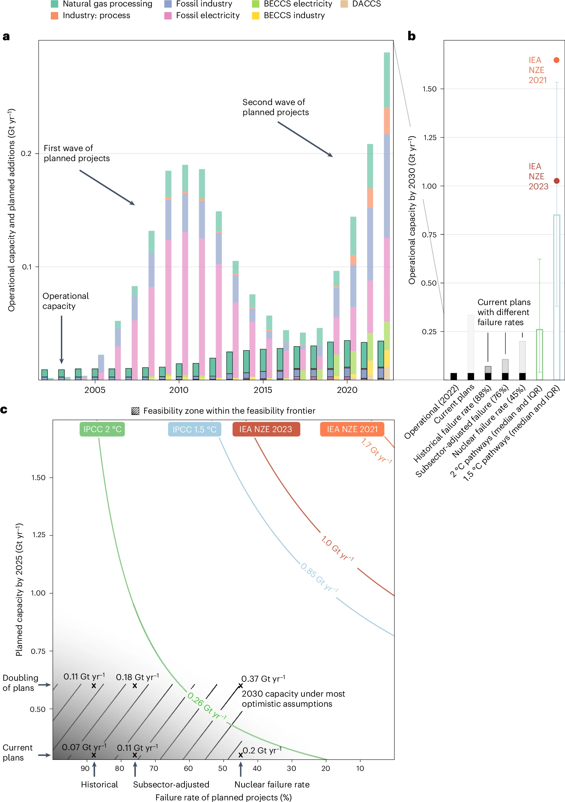
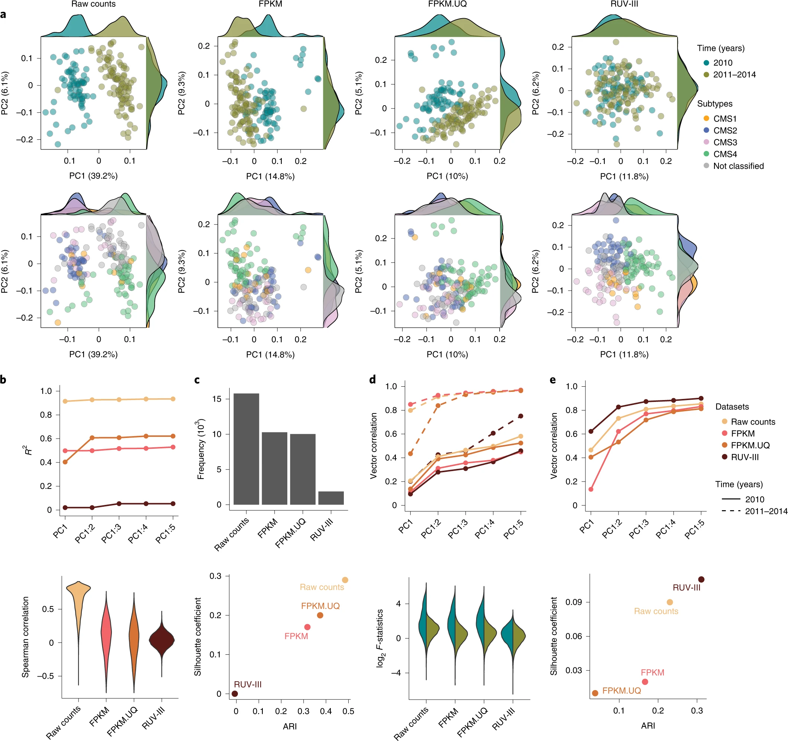
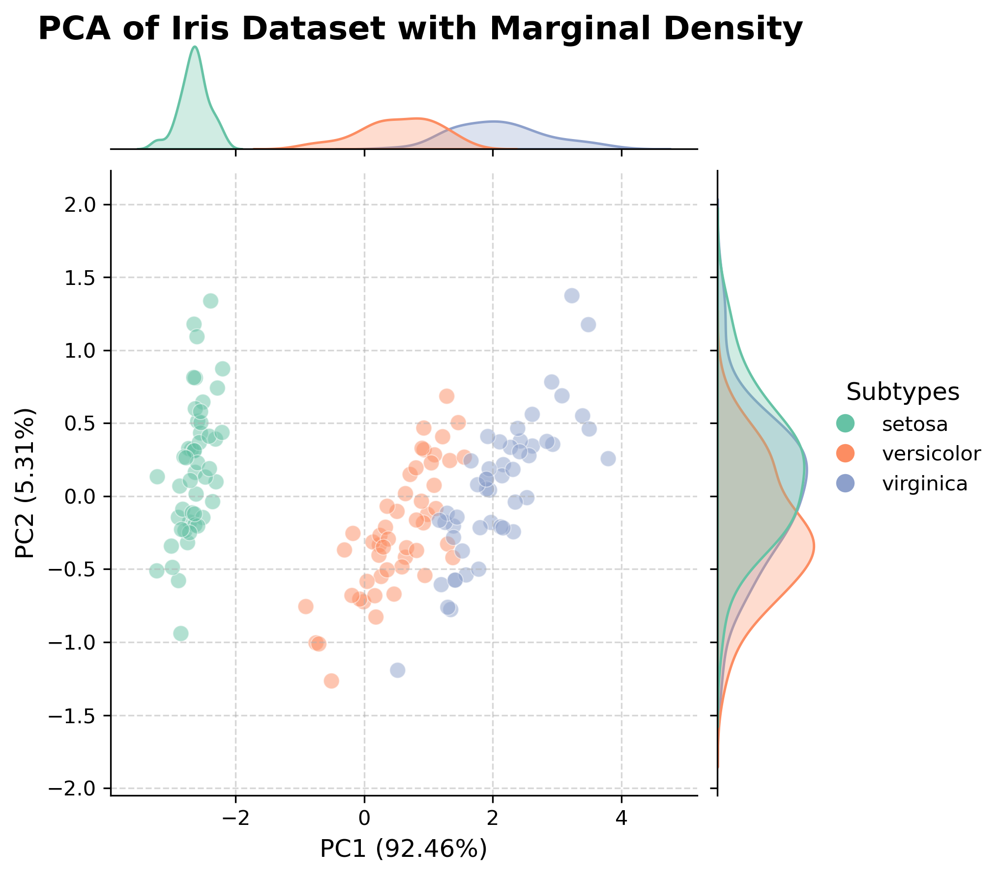

##  第三章：不同数据类型的可视化


### 3.1 时序数据可视化

#### 3.1.1 时序数据的特点
时间序列是非常常见的数据。一般由表示时间的x轴和表示数据值的y轴组成，使用折线图在显示数据随时间推移的进展时很常见。它在提取诸如趋势和季节性影响等信息方面有一些好处。


#### 3.1.2 时序数据的可视化


我们以 24年9月的nature climate change中的[Feasible deployment of carbon capture and storage and the requirements of climate targets](https://www.nature.com/articles/s41558-024-02104-0)这篇文章为例，尝试分析一下顶刊中的时序数据可视化是怎么实现的。  
这篇文章提供了一个很好的范例，展示了很好的时序数据是如何绘制的。




要在 R 中处理时间序列，首先需要将其置于时间序列对象中。这是一种 R 的结构，包含观察值及其对应的日期信息。一旦将数据放入时间序列对象中，就可以使用众多函数来操作、建模和绘制这些数据。

R 提供了多种用于存储时间序列的结构（详见侧栏“R 中的时间序列对象”）。在本章中，我们将使用由 xts 包提供的 xts 类。它支持规则和非规则间隔的时间序列，并提供了许多操作时间序列数据的函数。
R 中的时间序列对象

R 提供了许多用于存储时间序列数据的对象，很容易让人感到困惑。基础 R 包含了 ts 对象，用于存储具有规则时间间隔的单一时间序列，以及 mts 对象，用于存储具有规则时间间隔的多时间序列。

zoo 包提供了一个类，可以存储具有不规则时间间隔的时间序列，而 xts 包在 zoo 类的基础上扩展了更多支持函数。此外，还有一些常用的格式，如 tsibble、timeSeries、irts 和 tis。幸运的是，tsbox 包提供了将数据框转换为任意格式的函数，并能在不同的时间序列格式之间进行转换。

要创建一个 xts 时间序列，可以使用以下代码：

```r
library(xts)  
myseries <- xts(data, index)  
```


其中，data 是一个包含数值的向量，表示观测值；index 是一个日期向量，表示这些值的观测时间。以下示例展示了用法：数据是从 2018 年 1 月开始的两年的月度销售数据。


### 3.2 空间数据可视化
R与Python可以进行空间数据可视化的分析。

在Python中，工具如Pandas常用于通用数据分析，包括基本统计、数据透视表、模式匹配以及将数据导出为各种格式。而Geopandas进一步扩展了这些功能，专注于地理空间数据，支持地图绘制和基础的空间分析，例如空间连接和表格与地理特征的集成。

Python工具如Pandas可用于常规数据分析，涵盖基本统计、数据透视、模式匹配和数据格式转换。对于地理空间数据，Geopandas在Pandas基础上引入了空间数据结构，支持：

    地图绘制：如点、线、面等几何图形的可视化。
    空间分析：例如空间连接、缓冲区分析，以及表格数据与地理特征的结合。


在R方面，工具如dplyr和tidyr擅长数据表的重塑和子集选择。而在地理空间可视化领域，ggplot2和sf（Simple Features）尤为出色：

    高质量可视化：ggplot2以其美观、可高度定制的图表而闻名，并提供多种模板和配色方案。
    分层式图形语法：这种方法支持按步骤构建可视化图表，通过添加注释和统计变换层来丰富图表。
    与R Markdown的集成：能够无缝生成全面的报告和展示文档。

工具选择的考量

尽管这些R工具提供了精致的可视化能力，但它们主要面向R生态系统用户，更注重可视化而非空间数据操作。如果项目既需要初步数据可视化，又涉及后续的高级分析（如机器学习任务），在R与Python之间频繁切换可能会变得繁琐。

掌握Python中的地理空间可视化的理由

对于数据科学家，特别是处理大型独立项目的研究者来说，掌握R中的地理空间可视化可能显著优化工作流程。这可以在初步数据分析阶段创建复杂且视觉吸引力强的地图，而无需在不同编程环境间切换。当可视化不仅是一个前期步骤，而是在整个项目生命周期中持续需求时，这种技能尤为有用。

最终，在Python的Geopandas和R的ggplot2与sf之间的选择取决于项目的具体需求和用户对每种语言的熟悉程度。Python提供了直接且集成的工作方式，而R强大的可视化工具则无可匹敌。对于需要通过可视化讲述复杂地理空间数据故事的项目来说，它们是值得任何数据科学家掌握的宝贵工具。


### 3.3 高维数据可视化

#### 3.3.1 高维数据及降维方法
**什么是高维数据？**  

对于高维数据，我们可以分两部分来的定义与区分  
1.高维数据：指具有多个独立属性的结构化数据（一般是指超过3维的数据），比如基因表达矩阵、图像特征向量等。  
2.多变量数据：指具有多个相关属性的观测数据，例如气象数据（温度、湿度、风速之间可能有依赖关系）。

与常规的低维数据相比，高维数据的可视化所面临的挑战是人类感知维度的限制，以解释数据复杂性，呈现单个数据点的各属性的数据值分布；以及比较多个高维数据点之间的属性关系，从而提高高维数据的分类、聚类、关联、异常点检测、属性选择、属性关联分析和属性简化等任务的效率。因此，我们很多时候需要降维的方法来对数据进行可视化。  


**降维技术**

降维的目标有两个：一是保留数据的主要结构或分布。二是减少数据噪声，提升可视化效果。
数据降维方法有很多，本文对具体的降维方法的原则不做赘述，仅对其做基本的介绍。常见的降维方法有：  
1. 主成分分析（PCA）：通过线性变换，寻找方差最大的主轴。  
2. t-SNE（t-分布邻域嵌入）：适合非线性数据，可视化局部结构。   
3. 非负矩阵分解（NMF）：将原始矩阵分解为两个非负矩阵的乘积（特征和权重）。适用于文本分析或图像处理等应用场景。

每一种方法在python和R里都可以找到对应的包来实现。本节我们就以PCA为例，来实现高维数据的可视化。

### 3.3.2 高维数据可视化的实现

我们以22年Nature Biotechnology上的这篇[Removing unwanted variation from large-scale RNA sequencing data with PRPS](https://www.nature.com/articles/s41587-022-01440-w) 文章的配图为例



假如我们也想得到类似于上图的可视化效果，该如何做呢？


让我们来试一试。

首先让我们导入必要的库。我们这里准备采用的方法是主成分分析（PCA）。
```python
import pandas as pd
import numpy as np
import seaborn as sns
import matplotlib.pyplot as plt
from sklearn.datasets import load_iris
from sklearn.decomposition import PCA
```


我们引入基础的Iris鸢尾花数据集。这个数据集包含 150 条样本，分为 3 类：```setosa```、```versicolor```、```virginica```。每条样本包含了 4 个特征：```sepal length```、```sepal width```、```petal length```、```petal width```。利用鸢尾花数据集，我们可以尝试进行高维数据可视化复现。  
从 sklearn.datasets 加载 Iris 数据集，将其转换为 Pandas DataFrame 表格形式格式，便于后续处理。
```python
def load_and_prepare_data():
    iris = load_iris()
    df = pd.DataFrame(data=iris.data, columns=iris.feature_names)
    df['target'] = pd.Series(iris.target).map(dict(enumerate(iris.target_names)))
    return df, iris.feature_names

```
下面我们通过主成分分析 (PCA)的方法 将 4 维特征数据降维到 2 维，同时保留尽可能多的信息。
PCA通过主成分解释方差贡献度来衡量降维效果。我们构造 DataFrame，将降维结果命名为 PC1 和 PC2，并显示其解释方差。

```python
def perform_pca(data, n_components=2):
    features = data.iloc[:, :-1]
    pca = PCA(n_components=n_components)
    pca_result = pca.fit_transform(features)
    explained_variance = pca.explained_variance_ratio_
    pca_df = pd.DataFrame(
        pca_result, 
        columns=[f"PC1 ({explained_variance[0]*100:.2f}%)", 
                 f"PC2 ({explained_variance[1]*100:.2f}%)"]
    )
    return pca_df, explained_variance
```

然后我们将降维后的数据与类别标签合并，让数据格式统一，便于后续按类别区分颜色或形状。
```python
def merge_with_labels(pca_df, labels):
    return pd.concat([pca_df, labels], axis=1)
```

下一步是可视化 PCA 降维结果，我们可视化了散点图和类别的边缘密度分布。并通过边缘密度图等扩展方法丰富数据的表达效果，揭示样本的聚类模式，以更直观地理解数据的结构和潜在模式

我们自定义右侧图例，标注类别与颜色的对应关系。
 

```python
def plot_pca_results(data, explained_variance):
    # 设置柔和调色板
    palette = sns.color_palette("Set2", len(data['target'].unique()))
    
    # 创建 JointGrid 对象
    g = sns.JointGrid(data=data, 
                      x=data.columns[0], 
                      y=data.columns[1], 
                      hue='target', 
                      palette=palette)
    
    # 绘制散点图
    g.plot_joint(sns.scatterplot, 
                 s=60, alpha=0.5, edgecolor='w', linewidth=0.5, legend=False)

    # 绘制边缘密度图
    sns.kdeplot(data=data, x=data.columns[0], hue='target', ax=g.ax_marg_x, 
                fill=True, common_norm=False, palette=palette, alpha=0.3, legend=False, linewidth=1.2)
    sns.kdeplot(data=data, y=data.columns[1], hue='target', ax=g.ax_marg_y, 
                fill=True, common_norm=False, palette=palette, alpha=0.3, legend=False, linewidth=1.2)
    
    # 添加右侧图例
    handles = [plt.Line2D([0], [0], marker='o', color='w', markerfacecolor=palette[i], markersize=10) 
               for i in range(len(data['target'].unique()))]
    labels = list(data['target'].unique())
    g.fig.legend(handles=handles, labels=labels, 
                 loc='center right', fontsize=10, title='Subtypes', title_fontsize=12, frameon=False)

    # 调整布局
    g.fig.subplots_adjust(top=0.95, right=0.8, left=0.1)
    g.fig.suptitle('PCA of Iris Dataset with Marginal Density', fontsize=16, fontweight='bold', x=0.35)
    g.ax_joint.set_xlabel(data.columns[0], fontsize=12)
    g.ax_joint.set_ylabel(data.columns[1], fontsize=12)
    g.ax_joint.grid(True, linestyle='--', alpha=0.5)
    
    plt.show()
```
最终显示的结果如下图  



完整的代码可见[PCA of Iris Dataset with Marginal Density.ipynb](code/PCA%20of%20Iris%20Dataset%20with%20Marginal%20Density.ipynb)


<div style="border: 1px solid black; padding: 10px; border-radius: 5px;">
Q&A：

如果想用R语言得到类似的效果，我们可以如何实现？


提示：对于PCA，你可能会用到```stats```,```FactoMineR```,```factoextra```等库。
</div>


