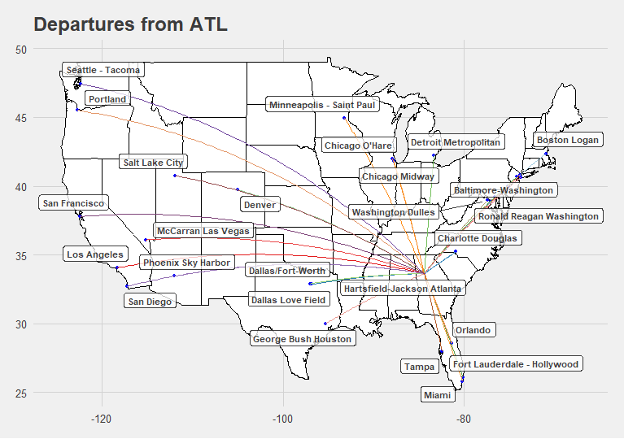
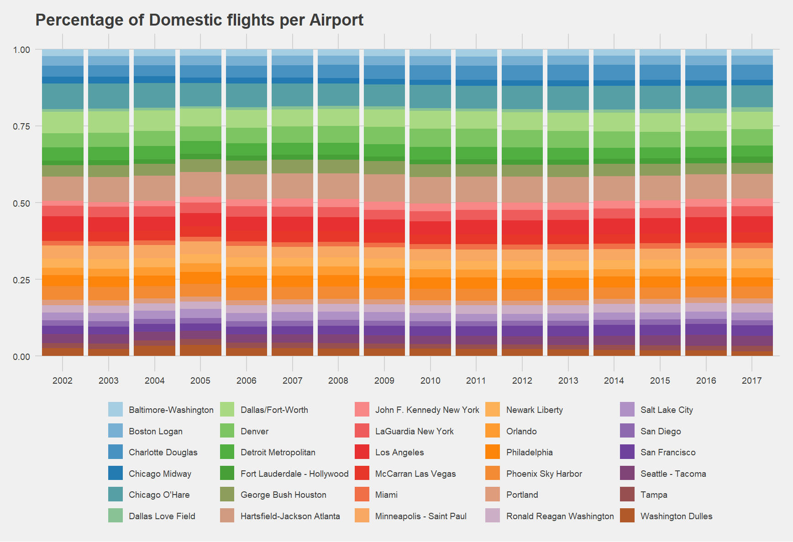

## 第四章 科研数据可视化项目实战
在这一章里，我们希望大家自己动手尝试一下从零到一的科研数据可视化的小项目。从找到一个数据集开始，一步一步入手可视化的流程。我们会为大家做一些框架性的讲解，并且提供一些范例，让整个可视化的流程更有操作性。

### 4.1 项目选题与数据准备
在科研数据可视化项目中，选题与数据准备是整个流程的基础。一个合适的选题不仅决定了研究的方向和深度，也会直接影响到后续的数据分析与可视化效果。数据准备涉及数据的获取、清洗、整理和格式转换，是确保数据质量和分析准确性的关键步骤。本节我们会探讨项目选题的原则与方法、数据收集与整理以及数据格式与兼容性问题。
#### 4.1.1 项目选题的原则与方法
如果你在项目选题时感到有些无从下手，有大致几个步骤可以作为参考：

1. 确定选题方向

关于确定研究的选题方向，有很多学者做过总结。匹兹堡大学的李华芳老师曾经在[学界新手怎样选择研究主题 ](https://mp.weixin.qq.com/s/ZRELE-pVuqb7UCNk7Qp_oA)提到过，主题需要具备“有趣”且“重要”，两条缺一不可。了解目标读者的背景和兴趣，确保选题能引起他们的共鸣。例如，航空票价是一个生活化且与旅行密切相关的主题，容易吸引注意。

2. 实际意义与创新性

我们选题尽量向着实际应用价值和创新性靠拢。要达成这个目标，选题最好以问题驱动，寻找能够解决的实际问题。我们可以做一些文献调研，了解当前领域的研究热点和空白。也可以通过跨学科融合的方式寻找创新点，探索新的研究缺口。

3. 明确可视化目标

研究者对于项目的背景和研究意义应该非常清晰，并且能够解释为什么这个项目值得进行可视化研究。换句话说，就是明确项目希望通过可视化解决什么问题或回答什么科学问题。例如，我们究竟是需要结果的直观展示，便于分享传播；还是探索性分析，通过可视化发现数据中的潜在模式和关系；亦或者验证性分析，验证特定的假设或研究问题。

选择一个与你的研究兴趣和专业背景相关的领域，可以提高项目的可持续性和深度。例如，如果你关注社会科学，社会调查数据的交互式可视化也许是一个不错的选择。

    

### 4.1.2 数据收集与整理

数据的质量对整个项目的成败有至关重要的影响，好的数据也便于后续的处理和分析。因此需要确保题目的数据来源可靠，并且易于获取。我们可以优先使用公开数据库、政府数据、科研机构提供的数据集等资源。
如果在手头没有本领域合适的数据库，可以从一些常规渠道获取：  
        Kaggle：提供各类公开数据集，适合不同领域的研究。
        NCBI（国家生物技术信息中心）：提供丰富的生物学数据，如基因序列、基因表达数据等。
        NASA：提供大量的气候与环境数据。  
如果没有已经整理好的数据库，我们也可以使用爬虫的形式进行数据爬取（需要注意法规）：  
        Python：使用requests库进行网页数据抓取。
        R：使用rvest包进行网页数据提取。

在数据库的选择上，还有几个注意事项：
1. 数据规模与复杂性
一次数据处理的数据量建议适中。数据量过小的话可能导致结论不具备普适性，过大的话可能在后续的分析中难以处理。

2. 可视化潜力

对于需要应用可视化的项目，数据应包含适合各种可视化类型的字段，例如我们在4.1.3中会举例的时间序列（航班延误趋势分析）、分类变量（不同航空公司对比）、地理分布（机场航班流量分布）等。

3. 可挖掘性

数据需要有实际问题可以探讨，例如航班延误的原因、航空公司的市场份额、热门机场的流量分布等。美国交通部航空数据支持多角度分析。

#### 4.1.3 案例

让我们来举一个例子好了。假如我们的目标是分析航空业内的航空运输数据，来理解各个航司乘客变化量的趋势。首先细分我们的项目目标
1. 乘客量变化趋势分析：
        国内、国际和总乘客量在多年间的趋势和季节性波动。
2. 分类对比分析：
        不同指标（乘客量、航班数、载客率等）在国内和国际航班之间的差异。
3. 关联分析：
        例如，载客率（Load Factor）和收入之间是否存在关联？

接着，我们需要选择一个合适的数据集。经过对比，在这里我们选了[美国的交通部的发布的](https://www.transtats.bts.gov/Data_Elements.aspx)包含美国主要航空公司和主要机场的各种指标数据。
这个数据从2002年开始，至今为止每月都在更新。让我们来评估一下这份数据对于我们后续工作的。整体来看，数据内容丰富，数据覆盖了航司和机场两部分，囊括国内和国际航班的乘客量（Passengers）、航班数（Flights）、收入（Revenue）等多维度指标；同时，时间跨度长，数据按年月分类，适合我们进行进行时间序列分析和趋势探索；在实际意义上，航空客运量和收入是交通和经济发展重要的衡量指标，分析结果对航空政策制定和市场预测有直接帮助。

然后，我们需要判断一下数据可视化在这个项目当中所起到的作用。在这个项目中，通过可视化，我们可以直观看到数据中的关键规律。主要包含三个维度：

1. 趋势分析：折线图清晰呈现国内和国际航班数据随时间的变化趋势。
2. 分类对比：条形图、堆积柱状图等展示不同分类的相对大小。
3. 多维关系：散点图或热力图可挖掘各指标间的关联性。

### 4.2 数据挖掘与可视化分析  

#### 4.2.1 数据挖掘

对于研究者而言，我们首先需要明确数据库的字段、记录及其含义，换句话说，要了解每个字段代表的内容以及它们之间的关系，并且对于字段含义和数据类型应当非常清晰。
一般来说，我们需要对数据集做一些预处理，比如加载数据，查看基本信息和数据分布。检查数据是否存在缺失值或异常值，并采取相应处理措施。

对于数据挖掘方法选择，需要分析数据的特点，如数据的维度、数据的分布、数据的噪声等，根据不同的特点选择合适的数据挖掘方法，如聚类分析、分类分析、回归分析、关联规则挖掘等。

数据挖掘工具比较常用的有如Python中的Scikit-learn、TensorFlow，R中的Caret、RandomForest等。

数据挖掘结果解读：解读数据挖掘结果，分析数据的模式、规律、异常等，并提出进一步的结论。

#### 4.2.2 可视化分析

可视化方法选择：根据数据的特点和研究问题，选择合适的可视化方法，如散点图、折线图、热力图、网络图等。

可视化工具选择：根据可视化方法和数据规模，选择合适的可视化工具，如Matplotlib、Seaborn、Tableau、Power BI等。

可视化实现：介绍如何使用选择的工具实现可视化，包括代码示例和操作步骤。

可视化结果解读：解读可视化结果，分析数据的分布、趋势、关系等，并提出初步的结论。

#### 4.2.3 案例

我们继续拿刚才的的数据作为例子继续我们的下一步的工作。
通过通过计算机场之间的地理大圆路径，我们生成航线数据。绘制机场与航线网络在地图上的分布，我们可以直观展示机场的航线网络布局。

然后我们可以按照时间绘制不同机场的流量百分比

### 4.3 可视化评估与优化

参考链接:

