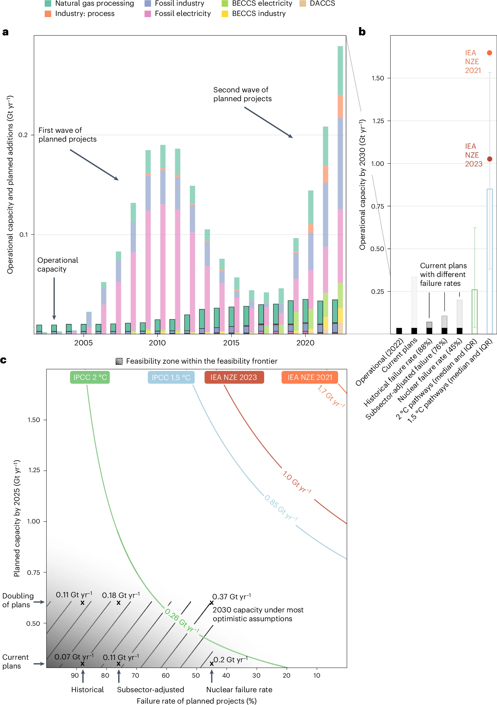
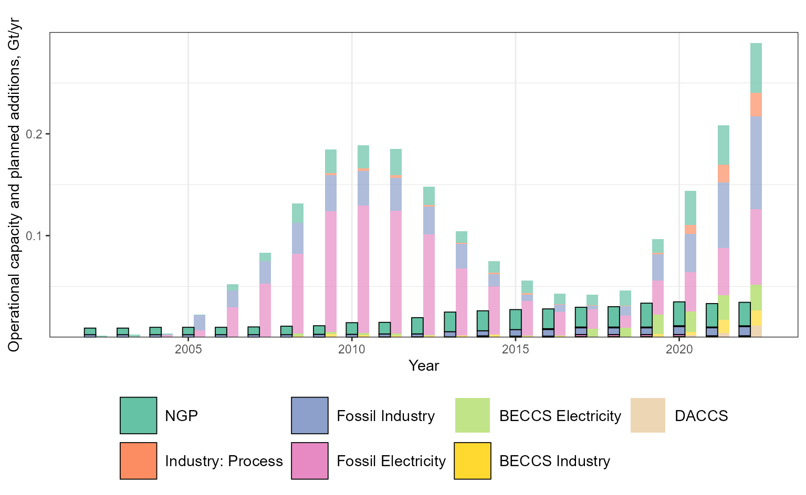
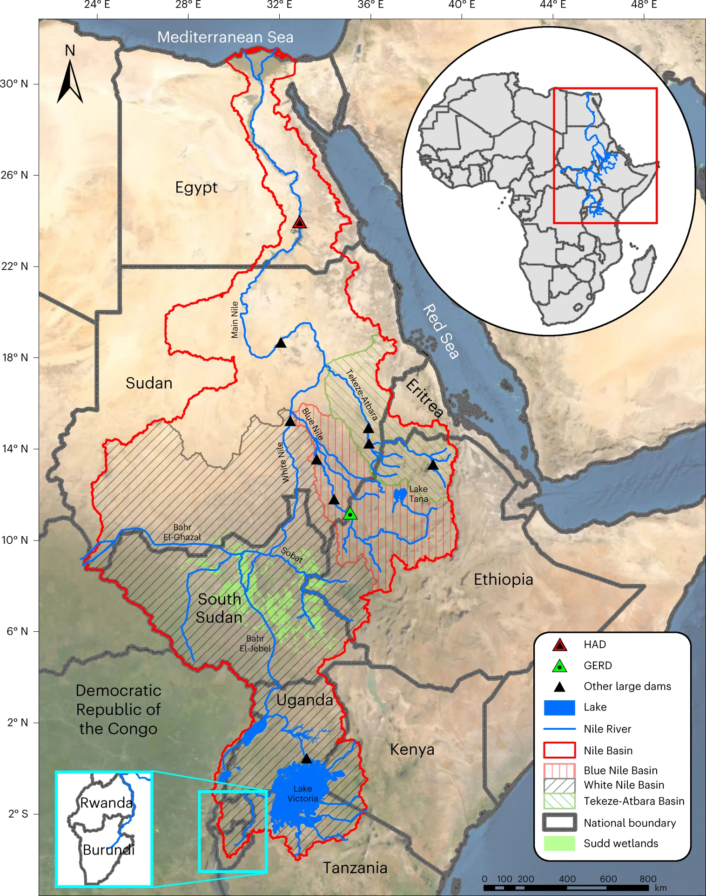
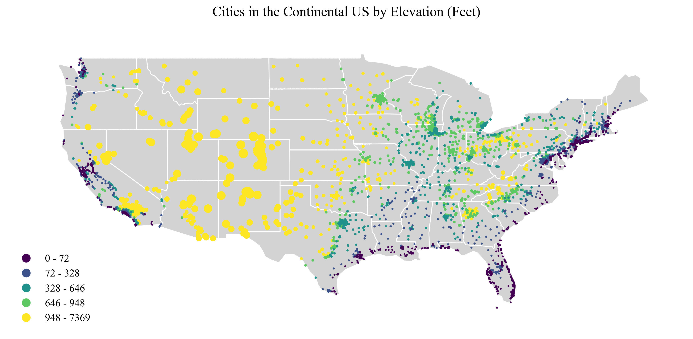
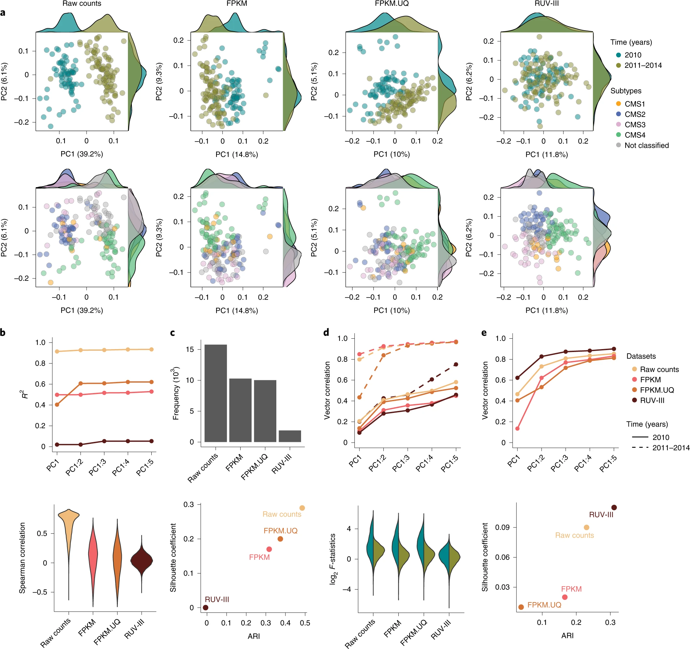
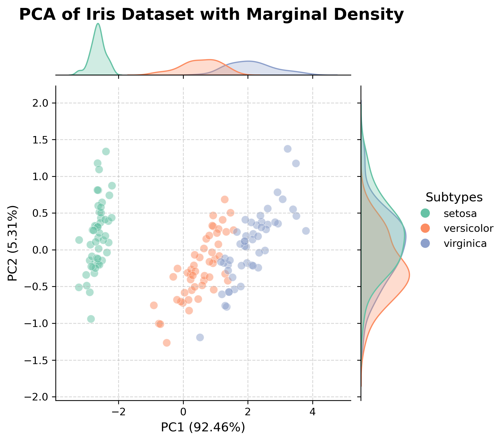

##  第三章 不同数据类型的可视化


### 3.1 时序数据可视化

#### 3.1.1 时序数据的特点
时间序列是非常常见的数据。一般由表示时间的x轴和表示数据值的y轴组成，使用折线图在显示数据随时间推移的进展时很常见。它在提取诸如趋势和季节性影响等信息方面有一些好处。目前，时序数据常用的图表类型有： 
1. 折线图：最常用的时序数据可视化方式，适合展示数据随时间的变化趋势。
2. 面积图：类似于折线图，但填充了下方区域，适合展示累积数据或强调总量变化。
3. 柱状图：适合展示离散时间点的数据对比，如月度销售额。


**注意事项**  
进行时序数据的可视化时，有两点特别需要注意，一是时间轴的设计。需要确保时间轴清晰且等间隔，避免时间跨度过大或过小导致信息丢失。我们要注意标注重要时间点或事件，以便理解数据变化的背景。
对于超长时间可视化的一些技巧，可以参考这篇文章 [超长时间序列数据可视化的6个技巧](https://mp.weixin.qq.com/s/q-DKrhi3bBdLHy5HGXQM4w)

还有一点需要注意的是处理多重时间序列的问题。我们可以使用不同颜色、线型或符号区分多条数据线，保持图表的清晰度。如果数据过多，可考虑分多个图表展示。

关于什么是好的时序数据可视化，这篇文章做了一些介绍 [Reducing Cognitive Load for Clearer Insights](https://python.plainenglish.io/effective-time-series-visualization-reducing-cognitive-load-for-clearer-insights-f91ee7d6ac1a)


#### 3.1.2 时序数据的可视化


我们以 24年9月的nature climate change中的[Feasible deployment of carbon capture and storage and the requirements of climate targets](https://www.nature.com/articles/s41558-024-02104-0)这篇文章为例，尝试分析一下顶刊中的时序数据可视化是怎么实现的。  
这篇文章提供了一个很好的范例，展示了很好的时序数据是如何绘制的。




本文的作者在Github上给出了论文所有可视化配图的开源代码[CCS_article](https://github.com/poletresearch/CCS_article)，以R文件的独立形式存放。对应的这张图的生成代码为[fig2_formative.R](code/fig2_formative.R).


该图包含了三幅图像，图a为时序图，图b为容量对比图，图c为散点图和等高线图。因此我们本节主要关注图a。

首先我们加载必要的包和数据，
```r
# 必要包
library(tidyverse)

# 读取数据
data <- read.csv("C:/Users/c3388/Downloads/CCS_article-main/CCS_Projects_database.csv") 
```
接着我们做一些数据处理，来提取特定年份的项目数据。
```r
pipeline_by_year <- function(data, year) {
  filtered_data <- data %>% 
    filter((Status %in% c("Completed", "Not finished", "Active") & FacilityStart <= year & 
              (FacilityEnd >= year | is.na(FacilityEnd))) |
             (Status %in% c("Not started", "Completed", "Not finished", "Active") & ProjectStart <= year & 
                ActualProjectEnd >= year) |
             (Status == "Future" & ProjectStart <= year))
  filtered_data$actyear <- year
  return(filtered_data)
}
```

对 2002 到 2022 年的每一年调用 pipeline_by_year，生成逐年项目数据。用一个综合数据框 years_all，记录了所有年份的项目动态。

```r
years_all <- data.frame(matrix(ncol = 26, nrow = 0))  # 初始化空数据框
colnames(years_all) <- colnames(data)

for (year in 2002:2022) {
  year_data <- pipeline_by_year(data, year)
  years_all <- rbind(years_all, year_data)
}
```
在综合数据框中新增两列：   
```status_year```: 标记项目在每年的状态。  
```mtpa```: 根据 status_year 填充实际或计划碳捕获量。  
然后按部门、年份聚合数据。
```r
years_all <- years_all %>% 
  mutate(status_year = 
           ifelse(Status %in% c("Completed", "Not finished", "Active") & FacilityStart <= actyear & 
                    (FacilityEnd >= actyear | is.na(FacilityEnd)), "Operational", "In Development")) %>%
  mutate(mtpa = ifelse(status_year == "Operational", ActualCapacity, AnnouncedCapacity))

h2 <- years_all %>% 
  subset(!is.na(Sector) & !is.na(mtpa)) %>%
  group_by(Sector, status_year, actyear) %>% 
  summarise(mtpa = sum(mtpa)) %>% 
  mutate(mtpa = mtpa * 365 / 1000000000)
  ```
接下来是可视化的部分，
我们先设置美学映射（aes），x 轴表示年份（从 2002 到 2022），y 轴表示碳捕获量（Gt/yr），填充颜色表示不同的 CCS 部门（如 "Fossil Electricity", "BECCS Industry" 等）。

```r
panelA <- ggplot(h2, aes(actyear, mtpa, fill = Sector)) +
```
用透明的条形图展示 "In Development" 状态项目的碳捕获量。
```r
geom_bar(data = subset(h2, status_year != "Operational"), 
         aes(x = actyear + 0.35, y = mtpa, 
             fill = factor(Sector, levels = c("NGP", "Industry: Process", "Fossil Industry", 
                                              "Fossil Electricity", "BECCS Electricity", "BECCS Industry", "DACCS"))),  
         stat = "identity", inherit.aes = FALSE, width = 0.35, alpha = .7) +

```
添加 "Operational" 状态的条形图，用黑边加以区分。
```r
geom_bar(data = subset(h2, status_year == "Operational"), 
         aes(x = actyear, y = mtpa, 
             fill = factor(Sector, levels = c("NGP", "Industry: Process", "Fossil Industry", 
                                              "Fossil Electricity", "BECCS Electricity", "BECCS Industry", "DACCS"))), 
         stat = "identity", inherit.aes = FALSE, width = 0.35, color = "black", size = 0.2) 
```
使用 RColorBrewer 提供的调色板 "Set2" 给不同部门分配颜色。
```r
scale_fill_brewer(palette = "Set2") 
```
添加图表标题和坐标轴标签并限制 x 轴范围
```r
labs(title = "", x = "Year", y = "Operational capacity and planned additions, Gt/yr") +
xlim(2001.8, 2022.6) +
```
定制图表样式
```r
theme_bw(base_size = 7) +
theme(panel.grid.minor.x = element_blank(), #去掉次网格线
      legend.title = element_blank(), #移除图例标题
      legend.position = "bottom", #将图例放在底部
      legend.text = element_text(size = 7), #调整图例文本大小
      panel.grid.major.y = element_blank()) + #去掉 y 轴的主网格线
```

最终的代码版本可以在[time_series_code.R](code/time_series_code.R)看到，所绘制的时序图如下图所示。




### 3.2 空间数据可视化


空间数据的可视化是一个较为专业的领域，我们可以在各种地方看到形式非常复杂的空间可视化图片。这类图片很多是采用了多工具联合的方法，例如在python进行可视化以后，再放到Illustrator中进行图片的二次修改。
例如，像是这样的图片，,就是多轮工具共同开发的结果。


R与Python都可以进行空间数据可视化的分析。在Python中，Geopandas和geoplot进一步扩展了Pandas的数据分析功能，支持地图绘制和基础的空间分析。Geoplot是基于 Geopandas 的高级地理数据可视化库，支持投影、点、线、多边形等丰富的可视化效果。  
在R方面，ggplot2和sf在地理空间可视化领域表现也尤为出色。

我们就拿Python举例，在geoplot的[原生库](https://github.com/ResidentMario/geoplot-data)中，我们可以找到[美国大陆边界数据](code/contiguous-usa.geojson)与[美国城市数据](usa-cities.geojson)（包括海拔高度）。两者都为GeoJSON 格式。

我们的目标是在地图上展示美国大陆城市的位置及其海拔高度，并通过颜色和点大小传达数据信息。以下代码展示了如何加载数据并生成地图:

首先导入必要的库，加载两个数据文件
```python
import geopandas as gpd  # 地理数据操作库
import geoplot as gplt  # 高级地理数据可视化库
import matplotlib.pyplot as plt  # 基础绘图库

# 1. 加载美国大陆州边界数据
contiguous_usa = gpd.read_file("contiguous-usa.geojson")  # GeoJSON 文件路径
print(contiguous_usa.head())  # 查看前几行数据结构

# 2. 加载美国城市数据
usa_cities = gpd.read_file("usa-cities.geojson")  # GeoJSON 文件路径
print(usa_cities.head())  # 查看前几行数据结构
```

在地图中，我们只需要展示美国大陆的城市，因此需要剔除夏威夷（HI）、阿拉斯加（AK）和波多黎各（PR）的数据。
```python
# 筛选出美国大陆的城市数据
continental_usa_cities = usa_cities.query('STATE not in ["HI", "AK", "PR"]')
print(continental_usa_cities.head())  # 确认筛选结果
```
然后我们绘制州边界和城市点。用浅灰色显示美国大陆的州边界，根据城市海拔高度调整点的大小和颜色。
```python
# 创建一个图形和子图，使用 PlateCarree 投影绘制地图
fig, ax = plt.subplots(figsize=(14, 10), subplot_kw={'projection': gplt.crs.PlateCarree()})

# 绘制美国大陆州边界
gplt.polyplot(
    contiguous_usa,            # 数据源
    edgecolor="white",         # 州边界颜色
    facecolor="lightgray",     # 州填充颜色
    ax=ax                      # 指定绘图的子图
)

```
我们将使用 pointplot 方法绘制城市点。点的颜色表示城市的海拔高度，点的大小根据海拔高度调整。
```python
# 在地图上绘制城市点
gplt.pointplot(
    continental_usa_cities,    # 数据源
    ax=ax,                     # 指定绘图的子图
    hue="ELEV_IN_FT",          # 按海拔高度着色
    cmap="viridis",            # 使用颜色渐变
    scheme="quantiles",        # 按分位数分类
    scale="ELEV_IN_FT",        # 按海拔调整点大小
    limits=(1, 10),            # 点大小范围
    legend=True,               # 显示图例
    legend_var="hue",          # 图例按颜色分组
    legend_kwargs={"frameon": False, "fontsize": 12}  # 图例样式
)

```
最终的完整代码可以在[USA_cities_elevation.ipynb](code/USA_cities_elevation.ipynb)中找到。可视化的结果如下图所示：




### 3.3 高维数据可视化

#### 3.3.1 高维数据及降维方法
**什么是高维数据？**  

对于高维数据，我们可以分两部分来的定义与区分  
1.高维数据：指具有多个独立属性的结构化数据（一般是指超过3维的数据），比如基因表达矩阵、图像特征向量等。  
2.多变量数据：指具有多个相关属性的观测数据，例如气象数据（温度、湿度、风速之间可能有依赖关系）。

与常规的低维数据相比，高维数据的可视化所面临的挑战是人类感知维度的限制，以解释数据复杂性，呈现单个数据点的各属性的数据值分布；以及比较多个高维数据点之间的属性关系，从而提高高维数据的分类、聚类、关联、异常点检测、属性选择、属性关联分析和属性简化等任务的效率。因此，我们很多时候需要降维的方法来对数据进行可视化。  


**降维技术**

降维的目标有两个：一是保留数据的主要结构或分布。二是减少数据噪声，提升可视化效果。
数据降维方法有很多，本文对具体的降维方法的原则不做赘述，仅对其做基本的介绍。常见的降维方法有：  
1. 主成分分析（PCA）：通过线性变换，寻找方差最大的主轴。  
2. t-SNE（t-分布邻域嵌入）：适合非线性数据，可视化局部结构。   
3. 非负矩阵分解（NMF）：将原始矩阵分解为两个非负矩阵的乘积（特征和权重）。适用于文本分析或图像处理等应用场景。

每一种方法在python和R里都可以找到对应的包来实现。本节我们就以PCA为例，来实现高维数据的可视化。

### 3.3.2 高维数据可视化的实现

我们以22年Nature Biotechnology上的这篇[Removing unwanted variation from large-scale RNA sequencing data with PRPS](https://www.nature.com/articles/s41587-022-01440-w) 文章的配图为例



假如我们也想得到类似于上图的可视化效果，该如何做呢？


让我们来试一试。

首先让我们导入必要的库。我们这里准备采用的方法是主成分分析（PCA）。
```python
import pandas as pd
import numpy as np
import seaborn as sns
import matplotlib.pyplot as plt
from sklearn.datasets import load_iris
from sklearn.decomposition import PCA
```


我们引入基础的Iris鸢尾花数据集。这个数据集包含 150 条样本，分为 3 类：```setosa```、```versicolor```、```virginica```。每条样本包含了 4 个特征：```sepal length```、```sepal width```、```petal length```、```petal width```。利用鸢尾花数据集，我们可以尝试进行高维数据可视化复现。  
从 sklearn.datasets 加载 Iris 数据集，将其转换为 Pandas DataFrame 表格形式格式，便于后续处理。
```python
def load_and_prepare_data():
    iris = load_iris()
    df = pd.DataFrame(data=iris.data, columns=iris.feature_names)
    df['target'] = pd.Series(iris.target).map(dict(enumerate(iris.target_names)))
    return df, iris.feature_names

```
下面我们通过主成分分析 (PCA)的方法 将 4 维特征数据降维到 2 维，同时保留尽可能多的信息。
PCA通过主成分解释方差贡献度来衡量降维效果。我们构造 DataFrame，将降维结果命名为 PC1 和 PC2，并显示其解释方差。

```python
def perform_pca(data, n_components=2):
    features = data.iloc[:, :-1]
    pca = PCA(n_components=n_components)
    pca_result = pca.fit_transform(features)
    explained_variance = pca.explained_variance_ratio_
    pca_df = pd.DataFrame(
        pca_result, 
        columns=[f"PC1 ({explained_variance[0]*100:.2f}%)", 
                 f"PC2 ({explained_variance[1]*100:.2f}%)"]
    )
    return pca_df, explained_variance
```

然后我们将降维后的数据与类别标签合并，让数据格式统一，便于后续按类别区分颜色或形状。
```python
def merge_with_labels(pca_df, labels):
    return pd.concat([pca_df, labels], axis=1)
```

下一步是可视化 PCA 降维结果，我们可视化了散点图和类别的边缘密度分布。并通过边缘密度图等扩展方法丰富数据的表达效果，揭示样本的聚类模式，以更直观地理解数据的结构和潜在模式

我们自定义右侧图例，标注类别与颜色的对应关系。
 

```python
def plot_pca_results(data, explained_variance):
    # 设置柔和调色板
    palette = sns.color_palette("Set2", len(data['target'].unique()))
    
    # 创建 JointGrid 对象
    g = sns.JointGrid(data=data, 
                      x=data.columns[0], 
                      y=data.columns[1], 
                      hue='target', 
                      palette=palette)
    
    # 绘制散点图
    g.plot_joint(sns.scatterplot, 
                 s=60, alpha=0.5, edgecolor='w', linewidth=0.5, legend=False)

    # 绘制边缘密度图
    sns.kdeplot(data=data, x=data.columns[0], hue='target', ax=g.ax_marg_x, 
                fill=True, common_norm=False, palette=palette, alpha=0.3, legend=False, linewidth=1.2)
    sns.kdeplot(data=data, y=data.columns[1], hue='target', ax=g.ax_marg_y, 
                fill=True, common_norm=False, palette=palette, alpha=0.3, legend=False, linewidth=1.2)
    
    # 添加右侧图例
    handles = [plt.Line2D([0], [0], marker='o', color='w', markerfacecolor=palette[i], markersize=10) 
               for i in range(len(data['target'].unique()))]
    labels = list(data['target'].unique())
    g.fig.legend(handles=handles, labels=labels, 
                 loc='center right', fontsize=10, title='Subtypes', title_fontsize=12, frameon=False)

    # 调整布局
    g.fig.subplots_adjust(top=0.95, right=0.8, left=0.1)
    g.fig.suptitle('PCA of Iris Dataset with Marginal Density', fontsize=16, fontweight='bold', x=0.35)
    g.ax_joint.set_xlabel(data.columns[0], fontsize=12)
    g.ax_joint.set_ylabel(data.columns[1], fontsize=12)
    g.ax_joint.grid(True, linestyle='--', alpha=0.5)
    
    plt.show()
```
最终显示的结果如下图  



完整的代码可见[PCA of Iris Dataset with Marginal Density.ipynb](code/PCA%20of%20Iris%20Dataset%20with%20Marginal%20Density.ipynb)


<br/>
<br/>

<div style="border: 1px solid black; padding: 10px; border-radius: 5px;">
Q&A：

如果想用R语言得到类似的效果，我们可以如何实现？


提示：对于PCA，你可能会用到```stats```,```FactoMineR```,```factoextra```等库。
</div>


